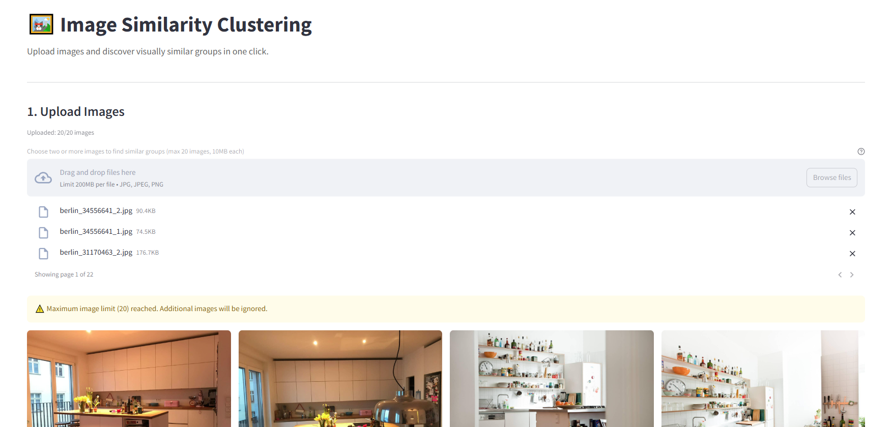
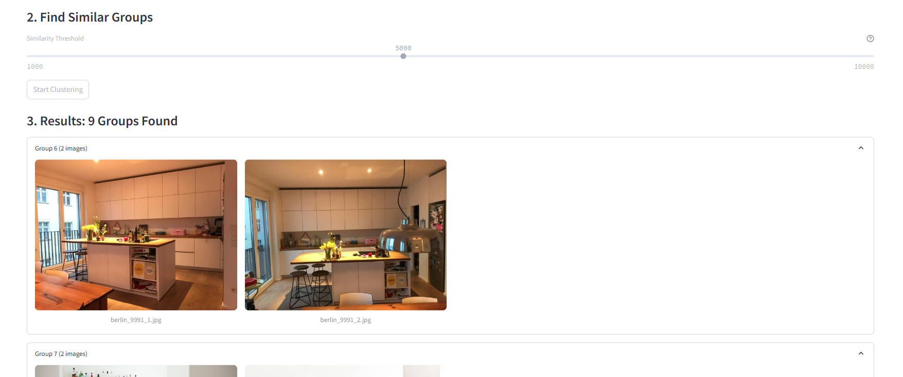
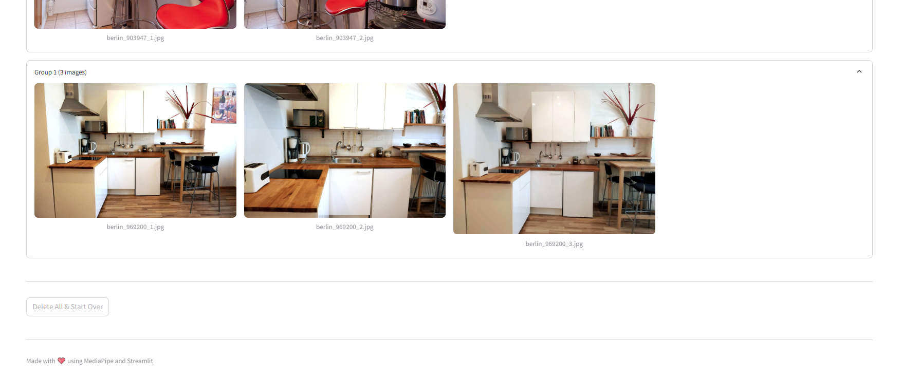

# Image Similarity Clustering Engine

This Streamlit application helps you discover visually similar groups within your image collection using MediaPipe's Image Embedder and hierarchical clustering. Upload your images, and the application will automatically group them based on visual similarity.

Key features:

- Support for up to 20 images (10MB each)
- Interactive similarity threshold adjustment
- Expandable group results view
- Powered by MediaPipe's MobileNet V3 model

## Built With

- Streamlit
- MediaPipe
- OpenCV
- Python
- SciPy (Hierarchical Clustering)

## App Screenshots







## Prerequisites

The application requires the MediaPipe MobileNet V3 model. Download it using:

```bash
powershell -Command "Invoke-WebRequest -Uri https://storage.googleapis.com/mediapipe-models/image_embedder/mobilenet_v3_small/float32/1/mobilenet_v3_small.tflite -OutFile models/mobilenet_v3_small.tflite"
```

## Local Setup

1. Clone the repo

   ```bash
   git clone https://github.com/pedropcamellon/image-similarity-clustering-engine.git
   cd image-similarity-clustering-engine
   ```

2. Install dependencies using uv

   ```bash
   uv sync
   ```


3. Run the Streamlit app

   ```bash
   streamlit run src/app.py
   ```

## Usage

1. Open the application in your web browser
2. Upload 2-20 images using the file uploader
3. Adjust the similarity threshold if needed
4. Click "Start Clustering"
5. View the results in expandable group sections

## Technical Details

### Core Components

1. **MediaPipe Image Embedding Pipeline**
   - Uses MobileNet V3 for feature extraction

2. **Clustering Engine**
   - Hierarchical clustering with customizable threshold
   - Cosine similarity measurements
   - Automatic group detection

### Performance Considerations

- Caching strategy using `@st.cache_data`
- Efficient image processing with OpenCV
- Upload limits for optimal performance
  - Maximum 20 images
  - 10MB per image

## License

This application is released under the [GNU General Public License](https://www.gnu.org/licenses/gpl-3.0.en.html).
